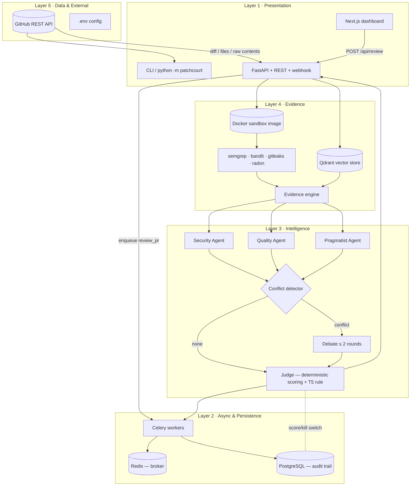

# PatchCourt

> Multi-agent, **evidence-tiered** AI code-review system for GitHub Pull Requests.


---

Three specialist LLM agents review a PR **in parallel**. Every claim is tied to a
static-analysis tool finding, repository policy, git precedent, or LLM reasoning —
each assigned a trust tier (T1–T5). ...

```
GitHub PR ──► ingest ──► RAG (Qdrant) ──► evidence engine ──► parallel agents ──► conflict ─► (debate?) ─► judge ─► report
                     └──────────────────────── tools ─────────┘                    (sandboxed)
```

## Features

- **Evidence engine** — static-analysis adapters (semgrep · bandit · gitleaks · radon) produce
  T1–T2 findings; *corroboration* (two tools on the same line → T2 + `corroborated` flag) is first-class.
- **Docker sandbox** — untrusted PR code is materialized and scanned inside an isolated
  container (`--network none`, memory/pids limits): analysis cannot touch your host.
- **Tiered trust + hard BLOCK rule** — T5 (LLM) claims can never force a block on their own.
- **Bounded debate** — ≤ 2 rounds, rebuttals pull *fresh* RAG evidence (retrieval-gated).
- **Offline demo** — runs with zero credentials (`mock` LLM + synthetic scanner or sandbox).
- **Async pipeline** — GitHub webhook → Celery → Redis; full audit trail in PostgreSQL.
- **Next.js dashboard** — courtroom-themed live evidence docket, tier filters, debate transcript.
- **LLM-agnostic** — mock / OpenAI / Claude / Gemini (free tier) / Ollama via `LLM_PROVIDER`.

## Screenshots

| Overview (KPI, charts, verdict, evidence) | Evidence Docket (table, filters, expandable) |
|:---:|:---:|
|  |  |

| Debate Transcript | SonarQube Baseline (comparison) |
|:---:|:---:|
|  |  |

## Architecture — five layers



### Evidence tiers

| Tier | Weight | Meaning |
|------|--------|---------|
| T1   | 1.0    | Direct static-analysis tool flag with `file:line` |
| T2   | 0.8    | Two tools agree on the same line (corroborated) |
| T3   | 0.5    | Retrieved from repo policy / standards (RAG) |
| T4   | 0.4    | Git precedent — pattern from history / similar PRs |
| T5   | 0.1    | LLM reasoning only — *never blocks alone* |

**Hard constraint (enforced in `judge/scoring.py`, unit-tested):** if the score
crosses the block threshold only via T5-only claims, the verdict is downgraded to
`NEEDS_REVIEW`.

## Quick start (no keys, fully offline)

```bash
python3 -m venv .venv && source .venv/bin/activate
pip install -e ".[dev]"
python -m patchcourt review --demo
```

You'll get a `BLOCK` verdict driven by real evidence: shell-command injection,
SQL string concatenation, and a hardcoded secret flagged by static analysis, with
a mock-LLM dispute resolved through the debate stage. Everything — evidence
engine, tiers, corroboration, conflict detector, debate, judge — runs against a
deterministic stub.

```bash
# run the whole stack instead
docker compose build sandbox
docker compose up -d                                  # postgres + redis + qdrant + api
docker compose --profile worker --profile dashboard up # + celery worker + dashboard
curl -X POST localhost:8000/api/review/demo            # -> BLOCK
open http://localhost:3000                             # dashboard
```

## Usage

### CLI

```bash
python -m patchcourt review https://github.com/octocat/Hello-World/pull/1
python -m patchcourt review --demo                      # offline demo
python -m patchcourt review <pr_url> --quiet           # machine-readable
```

### REST API

```bash
curl -X POST http://localhost:8000/api/review/demo             # offline demo
curl -X POST http://localhost:8000/api/review \
  -H 'Content-Type: application/json' \
  -d '{"pr_url":"https://github.com/octocat/Hello-World/pull/1"}'

curl http://localhost:8000/api/baseline/latest                 # newest saved SonarQube baseline (instant, offline-safe)
curl -X POST http://localhost:8000/api/baseline \              # fresh comparison — needs SonarQube running
  -H 'Content-Type: application/json' \
  -d '{"pr_url":"https://github.com/octocat/Hello-World/pull/1"}'
```

### GitHub webhook

```bash
curl -X POST http://localhost:8000/api/webhook/github \
  -H 'Content-Type: application/json' -H 'X-GitHub-Event: pull_request' \
  -d '{"action":"opened","pull_request":{"html_url":"https://github.com/octocat/Hello-World/pull/1"}}'
```

Returns `202` and hands the review to a Celery worker
(`package.json`-free — `patchcourt.worker.review_pr`). A `503` is returned when
`REDIS_URL` is unset. Every review is written to the PostgreSQL audit trail.
Repo webhook URL: `http://<host>:8000/api/webhook/github`.

### Dashboard (Next.js)

```bash
cd dashboard && npm install && npm run dev        # http://localhost:3000
npx shadcn@latest add button card badge tabs select input separator skeleton textarea label
```

Paste a PR URL (or hit **Offline Demo**). The courtroom-themed UI shows the
verdict banner, the evidence docket (filter/sort by tier, severity, agent;
corroborated pills), the debate transcript, a living T1–T5 legend, and a raw
audit-payload toggle. A second tab, **SonarQube Baseline**, renders the latest
saved baseline report instantly (even when the Sonar container is down):
raw finding count + severity breakdown, PatchCourt's verdict for the same PR,
and a three-group diff (confirmed/corroborated, down-tiered as unbacked,
Sonar-missed) with the headline
`SonarQube raw: N | PatchCourt confirmed: M | suppressed as unbacked: N-M`.
**Refresh baseline** runs a fresh `POST /api/baseline` (needs SonarQube up);
**Open SonarQube UI** links to `http://localhost:9000`.
`NEXT_PUBLIC_API_BASE` defaults to `http://localhost:8000`.

## LLM providers

Set `LLM_PROVIDER` (default `mock`) in `.env`:

| Provider | `LLM_PROVIDER` | Needs | Default model |
|----------|----------------|-------|---------------|
| Mock (deterministic stub) | `mock` | nothing | — |
| OpenAI | `openai` | `LLM_API_KEY` | `gpt-4o` |
| Anthropic Claude | `claude` | `LLM_API_KEY` | `claude-3-5-sonnet-latest` |
| Google Gemini (free tier) | `gemini` | `LLM_API_KEY` (AI Studio) | `gemini-2.5-flash` |
| Local Ollama | `ollama` | running Ollama server | `llama3.1` |

`LLM_BASE_URL` overrides the endpoint for `openai` (vLLM / LM Studio) and
`ollama` (defaults to `http://localhost:11434/v1`). Optional extras:
`pip install -e ".[llm]"` for Claude/Gemini, `pip install -e ".[rag]"` for
sentence-transformers embeddings (a deterministic hashing embedder is the
fallback).

## Docker Compose

| Service | Image | Role |
|---------|-------|------|
| `api`       | `patchcourt-api:latest`        | FastAPI: REST, webhook, dashboard backend, sandbox orchestration |
| `worker`    | `patchcourt-api:latest`        | Celery consumer of `review_pr` |
| `dashboard` | `patchcourt-dashboard:latest`  | Next.js courtroom UI (profile: `dashboard`) |
| `postgres`  | `postgres:16-alpine`           | Audit trail persistence |
| `redis`     | `redis:7-alpine`               | Celery broker |
| `qdrant`    | `qdrant/qdrant`                | Vector store for RAG grounding |
| `sandbox`   | `patchcourt-sandbox`           | Build-only tool image (profile: `tools`) |

The API/worker images ship the Docker CLI and mount the host socket, plus a
host-visible working directory (`SANDBOX_WORKDIR`) so per-run tool containers can
be launched against the same daemon — verified against Docker Desktop on macOS
and Linux daemons.

```bash
docker compose build sandbox          # build the tool image once
docker compose up -d                  # postgres, redis, qdrant, api
docker compose --profile worker up -d # optional: async webhook consumer
docker compose --profile dashboard up # optional: dashboard on :3000
```

## SonarQube baseline (stage 8)

Standalone SonarQube + a baseline comparison that maps *unresolved* SonarQube
issues onto the files a GitHub PR actually changes. Blocker/Critical findings
are mapped to **T1** tool-grade evidence, Major → T2, Minor → T3, Info → T4.

```bash
# one shot: boot SonarQube (embedded DB), create token, scan the repo, write report
bash scripts/run_sonar_demo.sh                       # optional PR_URL=...

# or manually, against an already-running SonarQube:
docker compose -f docker-compose.sonar.yml up -d
python -m patchcourt baseline https://github.com/octocat/Hello-World/pull/1
```

Output lands in `reports/baseline-<owner>-<repo>-<num>-<ts>.md` (+ `.json`):
total open issues, how many touch the PR, severity/type breakdown, and a
row-per-issue table with the suggested PatchCourt tier. Env:
`SONAR_URL`, `SONAR_TOKEN`, `SONAR_COMPONENT` (defaults in `.env.example`).

The same JSON is served by `GET /api/baseline/latest` (newest saved report,
no live SonarQube needed — the compose `api` mounts `./reports`). The
dashboard **SonarQube Baseline** tab reads it on load; **Refresh baseline**
calls `POST /api/baseline`, which fetches a fresh Sonar comparison, runs a
PatchCourt review of the PR, and reconciles the two into confirmed
(corroborated), down-tiered/unbacked, and Sonar-missed groups before saving a
new report.

## Configuration (`.env`)

Copy `.env.example` to `.env`. Everything is optional; the system runs offline
with no keys.

| Variable | Purpose | Default |
|----------|---------|---------|
| `GITHUB_TOKEN` | GitHub API token (rate limits, private repos) | *(anonymous)* |
| `LLM_PROVIDER` | `mock`\|`openai`\|`claude`\|`gemini`\|`ollama` | `mock` |
| `LLM_API_KEY` | Key for openai/claude/gemini | — |
| `LLM_BASE_URL` | OpenAI-compatible / Ollama base URL | `https://api.openai.com/v1` |
| `LLM_MODEL` | Model name | `gpt-4o` |
| `USE_MOCK_LLM` | Force deterministic mock | auto |
| `PATCHCOURT_TOOLS` | Commas-separated adapters | `semgrep,bandit,gitleaks,radon` |
| `USE_SYNTHETIC_TOOLS` | Add offline scanner | `false` |
| `SANDBOX_ENABLED` | Run tools in Docker sandbox | `false` |
| `SANDBOX_IMAGE` / `SANDBOX_WORKSPACE` / `SANDBOX_WORKDIR` | Sandbox tuning | `patchcourt-sandbox:latest` / `/workspace` / `""` |
| `QDRANT_URL` / `QDRANT_COLLECTION` | Vector store | empty ⇒ in-memory |
| `REDIS_URL` | Celery broker | empty ⇒ no async |
| `DATABASE_URL` | SQLAlchemy audit DB | empty ⇒ no audit |
| `SONAR_URL` / `SONAR_TOKEN` / `SONAR_COMPONENT` | SonarQube baseline (stage 8) | `http://localhost:9000` |

## Module layout

```
patchcourt/
├── agents/      # schemas, base agent, Security/Quality/Pragmatist specialists
├── ingest/      # GitHub REST ingestion (httpx) — diff, files, raw contents
├── rag/         # chunking + Qdrant store (real embeddings or deterministic hash)
├── evidence.py  # tier assignment + tool↔LLM corroboration (Evidence engine)
├── tools/       # adapter interface + semgrep/bandit/gitleaks/radon/synthetic
├── sandbox/     # containerized tool execution (docker CLI via socket)
├── baseline/    # SonarQube issue fetch + PR comparison + markdown/JSON report
├── debate/      # conflict detection + bounded retrieval-gated debate
├── judge/       # deterministic scoring + verdict + BLOCK-never-on-T5 rule
├── db/          # SQLAlchemy models + audit persistence (PostgreSQL)
├── worker/      # Celery app + review_pr task
├── api/         # FastAPI: /api/review, /api/review/demo, /api/webhook/github, /api/baseline/latest, /api/baseline
├── cli.py       # `python -m patchcourt review|baseline`
├── llm.py       # provider dispatch (mock/openai/claude/gemini/ollama)
└── config.py    # .env settings + tier weights
```

## Tests

```bash
pytest -q
```

Covered: tier weights, judge scoring math, the **BLOCK-on-T5-alone** rule,
conflict gating, PR URL parsing, evidence-engine corroboration, Qdrant store,
sandbox graceful-skip behavior, webhook routing, Celery task registration, LLM
provider dispatch, SonarQube baseline comparison, and an offline end-to-end
pipeline through the real LangGraph + RAG + judge stack with a fake LLM.

## Field demo runbook

The full ordered path, from a clean clone to a live container sandbox review:

1. **Bootstrap**
   ```bash
   python3 -m venv .venv && source .venv/bin/activate
   pip install -e ".[dev]"
   cp .env.example .env        # optional; everything defaults to mock/offline
   ```

2. **Unit/offline checks**
   ```bash
   pytest -q                                    # 51 tests
   python -m patchcourt review --demo           # BLOCK 15.8, 1 debate (no keys)
   ```

3. **Sandbox tool image** (isolated analysis runtime)
   ```bash
   docker compose build sandbox
   ```

4. **Full stack** — Postgres + Redis + Qdrant + API (dashboard + worker opt-in)
   ```bash
   docker compose up -d
   docker compose --profile worker --profile dashboard up -d
   curl -X POST localhost:8000/api/review/demo   # BLOCK via real sandbox tools
   docker compose exec -T postgres psql -U patchcourt -d patchcourt \
     -c "SELECT pr_url, verdict, overall_score FROM pr_reviews ORDER BY id DESC LIMIT 3;"
   ```

5. **Async webhook → Celery** (writes a public PR through the queue)
   ```bash
   curl -X POST localhost:8000/api/webhook/github \
     -H 'Content-Type: application/json' -H 'X-GitHub-Event: pull_request' \
     -d '{"action":"opened","pull_request":{"html_url":"https://github.com/octocat/Hello-World/pull/1"}}'
   docker compose logs worker --tail=20        # watch ingest → qdrant → sandbox → audit
   ```

6. **Dashboard**
   ```bash
   # open http://localhost:3000 — click "Offline Demo", or paste a PR URL.
   cd dashboard && npm install && npm run dev  # alternate local run
   ```

7. **SonarQube baseline**
   ```bash
   bash scripts/run_sonar_demo.sh              # boots SonarQube, scans repo, writes reports/
   ```

8. (Optional) **Real LLM grounding**
   ```bash
   # .env
   LLM_PROVIDER=gemini   # or claude / openai / ollama
   LLM_API_KEY=...
   python -m patchcourt review https://github.com/<owner>/<repo>/pull/<n>
   ```
